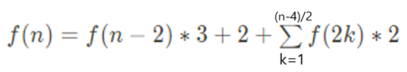

# LEVEL 1 

## 1. 구현

* Collection(Map, Set, List)
  * [신고 결과 받기](https://programmers.co.kr/learn/courses/30/lessons/92334) - 

1. map, set 으로 구현

신고한사람 : 신고당한 사람(중복 ㄴ) / 신고당한 사람 : 신고 당한 횟수 / k번 이상 신고당한 사람들

2. id마다 신고당한 사람들 퇴출 된사람 수 세기

* 그래프
  * [키패드 누르기](https://programmers.co.kr/learn/courses/30/lessons/67256)

1. 키패드 그래프화 하기
2. 무조건 왼손 쓰는경우
3. 무조건 오른손 쓰는 경우
4. 거리 가까운손 쓰기 / 거리가 같으면 주로쓰는 손 사용


## 2. 문자열

* replace()

  * [신규 아이디 추천](https://programmers.co.kr/learn/courses/30/lessons/72410)
  * [숫자 문자열과 영단어](https://programmers.co.kr/learn/courses/30/lessons/81301)

  

## 3. 수학

* 소수
* 공배수, 공약수
* 홀수, 짝수

* 문자열


## 4. 자료구조


* Stack, Queue
  * [크레인 인형뽑기 게임](https://programmers.co.kr/learn/courses/30/lessons/64061)
    1. 해당 자리 맨위부터 뽑기
    2. 바구니 맨위에 거라 같으면 score += 2
       1. 비어있으면 걍 넣기
       2. 맨 위에거랑 다르면 넣기

## 5. 그리디


## 6. 완전탐색


////////////////////////////////////

* [로또의 최고 순위와 최저 순위](https://programmers.co.kr/learn/courses/30/lessons/77484)

  1. 번호일치,  0갯수세기 구현 -> 완전탐색

  2. 최고, 최저 순위 구현 

  

* [단체사진 찍기](https://programmers.co.kr/learn/courses/30/lessons/1835)

  1. 8명 순열 구하기
  2. 순열 하나 씩 조건 만족하는 지 확인

* [소수 만들기](https://programmers.co.kr/learn/courses/30/lessons/12977)

  1. 숫자 3개 뽑기 - 중복ㄴ 조합
  2. 다 더한게 소수인지 판별하기 - 단일 소수 판별

* [완주하지 못한 선수](https://programmers.co.kr/learn/courses/30/lessons/42576)

  Map

  1. 참가자 map에 넣기
  2. 완주자 한명씩 확인
     1. 있으면 cnt--;
     2. cnt == 0 -> revmove

* [K번째수](https://programmers.co.kr/learn/courses/30/lessons/42748)

  Array Index

  1. a~b 번째 수 자르기
  2. 오름차순 정렬
  3. n번째 수 출력

* [모의고사](https://programmers.co.kr/learn/courses/30/lessons/42840)

  나머지 연산, 최댓값 찾기

  1. 문제 맞춘수 세기- 나머지 연산 + Array idx
  2. 가장 많이 맞춘 수 - Math.max()

* [체육복](https://programmers.co.kr/learn/courses/30/lessons/42862) v

  그리디

  1. 체육복 수 구하기
  2. 체육복 없는 경우만 앞,뒤 여벌 체육복 빌리기 - 앞부터 빌리기(그리디)
  3. 체육복 있는 학생수 세기

* [폰켓몬](https://programmers.co.kr/learn/courses/30/lessons/1845)

  Set - 종류가 가장 많게 n/2개 뽑기

  1. 폰켓몬 종류 갯수 구하기 - set
  2. 종류, n/2 중 최솟값 출력 - Math.min()

* [실패율](https://programmers.co.kr/learn/courses/30/lessons/42889)

  자료형 - doiuble

  1. 도달했지만 못깬경우의 수 구하기
  2. 깬 경우의 수 구하기
  3. 실패율 구하기 - double

* [약수의 개수와 덧셈](https://programmers.co.kr/learn/courses/30/lessons/77884)

  1. 약수 갯수 구하기
  2. 약수 갯수 홀수 짝수 확인 - > 짝수면 더하기 홀수면 빼기

* [예산](https://programmers.co.kr/learn/courses/30/lessons/12982)

  그리디

  1. 정렬
  2. 더하기
     1. 작으면 계속 더하기 cnt+=
     2. 크거나 작으면 break

* [두 개 뽑아서 더하기](https://programmers.co.kr/learn/courses/30/lessons/68644)

  nC2 + 더하기 + 중복 ㄴ

* [2016년](https://programmers.co.kr/learn/courses/30/lessons/12901) v

  구현 

  1. 달마다 일 구현
  2. 총 일수 구하기
  3. 차이 일수 구하기
  4. 요일 구하기

* [최소직사각형](https://programmers.co.kr/learn/courses/30/lessons/86491) 

  구현

  1. 각 직사각형 최댓값 최솟값 구하기
  2. 최댓값을 세로, 최소값을 가로로 고정함
  3. 이전 세로 가로랑 비하기 -> 최댒값으로 초기화
  4. 가로 x 세로 출력

* [나머지가 1이 되는 수 찾기](https://programmers.co.kr/learn/courses/30/lessons/87389)

  나머지 연산

* [부족한 금액 계산하기](https://programmers.co.kr/learn/courses/30/lessons/82612)

  구현

  1. 총가격 = 1~n합 * 가격 
  2. 가지고 있는 돈이랑 비교
     1. 안부족하면 0 출력
     2. 부족하면 차이만큼 출력

* [가운데 글자 가져오기](https://programmers.co.kr/learn/courses/30/lessons/12903)

  짝홀 확인 + substring()

* [같은 숫자는 싫어](https://programmers.co.kr/learn/courses/30/lessons/12906)

  연속 같은 숫자 확인 

  	1. 이전거랑 다른게 나올때만 추가
  	1. 이전거 초기화

* [나누어 떨어지는 숫자 배열](https://programmers.co.kr/learn/courses/30/lessons/12910)

  나머지 연산 + 정렬

* [두 정수 사이의 합](https://programmers.co.kr/learn/courses/30/lessons/12912)

  최솟값 ~ 최댓값 다 더하기 

* [문자열 내 마음대로 정렬하기](https://programmers.co.kr/learn/courses/30/lessons/12915)

  charAt, substring, sort

  1. str 마다 n번째 문자를 맨앞에 붙이기 
  2. 정렬하기
  3. 첫번째 문자빼고 출력하기

* [문자열 내 p와 y의 개수](https://school.programmers.co.kr/learn/courses/30/lessons/12916)

  문자갯수 세기 + 갯수 비교하기

* [문자열 내림차순으로 배치하기](https://school.programmers.co.kr/learn/courses/30/lessons/12917) v

  문자 배열 내림차순 정렬 

  ​	할줄 몰라서 오름차순 정렬 -> for문으로 뒤에서부터 추가함

* [문자열 다루기 기본](https://school.programmers.co.kr/learn/courses/30/lessons/12918)

  문자열 길이 + 숫자 확인

* [서울에서 김서방 찾기](https://school.programmers.co.kr/learn/courses/30/lessons/12919)

  str.equals() + idx

* [소수 찾기](https://school.programmers.co.kr/learn/courses/30/lessons/12921) v

  다수 소수판별 - 처리 중복될수 있으므로 boolean[] 쓰자

* [수박수박수박수박수박수?](https://school.programmers.co.kr/learn/courses/30/lessons/12922)

  홀수짝수 구분 + 반복문 문자열 더하기

* [문자열을 정수로 바꾸기](https://school.programmers.co.kr/learn/courses/30/lessons/12925)

  문자열 -> 정수

* [시저 암호](https://school.programmers.co.kr/learn/courses/30/lessons/12926)

  아스키코드

* [약수의 합](https://school.programmers.co.kr/learn/courses/30/lessons/12928)

  약수 구하기 + 합

* [이상한 문자 만들기](https://school.programmers.co.kr/learn/courses/30/lessons/12930)

  홀수 짝수 구분 + 공백 영문자 구분 + 대소문자 변환

* [자릿수 더하기](https://school.programmers.co.kr/learn/courses/30/lessons/12931)

  10나머지 더하기 + 10나누기 -> 반복 0될때까지

* [자연수 뒤집어 배열로 만들기](https://school.programmers.co.kr/learn/courses/30/lessons/12932)

  숫자 -> 문자열 -> 뒤집기

* [정수 내림차순으로 배치하기](https://school.programmers.co.kr/learn/courses/30/lessons/12933) v

  1. 숫자 자리수 봅아내기
  2. 오름차순 정렬
  3. sum += 10^i * list.get(i)

* [정수 제곱근 판별](https://school.programmers.co.kr/learn/courses/30/lessons/12934)

  제곱근 + 제곱

* [제일 작은 수 제거하기](https://school.programmers.co.kr/learn/courses/30/lessons/12935) v

  제일 작은수 찾기 -> 제일 작은수와 같으면 continue / 다르면 넣기

  제일 작은수가 여러개 인경우를 고려안해서 틀림

* [짝수와 홀수](https://school.programmers.co.kr/learn/courses/30/lessons/12937)

  홀짝 구분

* [최대공약수와 최소공배수](https://school.programmers.co.kr/learn/courses/30/lessons/12940) v

  최대공약수 + 최소공배수

* [콜라츠 추측](https://school.programmers.co.kr/learn/courses/30/lessons/12943) v

  홀짝 구분 + 반복문 조건

  자료형 주의

* [평균 구하기](https://school.programmers.co.kr/learn/courses/30/lessons/12944)

  합 구하기 -> 나누기(자료형 주의)

* [하샤드 수](https://school.programmers.co.kr/learn/courses/30/lessons/12947)

  자릿수 합 구하기 -> 나머지 0인지 확인

* [핸드폰 번호 가리기](https://school.programmers.co.kr/learn/courses/30/lessons/12948)

  substring()

* [행렬의 덧셈](https://school.programmers.co.kr/learn/courses/30/lessons/12950)

  배열 덧셈

* [x만큼 간격이 있는 n개의 숫자](https://school.programmers.co.kr/learn/courses/30/lessons/12954)

  등차수열 구현

* [직사각형 별찍기](https://school.programmers.co.kr/learn/courses/30/lessons/12969)

  반복문 행, 열


# LEVEL 2

* [문자열 압축](https://programmers.co.kr/learn/courses/30/lessons/60057)
  1. 1~n/2 단위로 자르기
  2. 숫자(반복된 숫자, 1은 안해도됨)+반복된 문자 
  3. 최소길이 구하기

* [오픈채팅방](https://programmers.co.kr/learn/courses/30/lessons/42888)
  1. 신고한 사람 : 신고당한 사람 
  2. 신고당한 사람 : 신고당한 횟수 
  3. 퇴출 된 사람 list
  4. 신고한 사람 : 신고당한 사람 +  퇴출된사람 list -> 퇴출당한 사람 수 세기

* [카카오 프렌즈 컬러링북](https://programmers.co.kr/learn/courses/30/lessons/1829)
  1. 방문안하고 색 있는거
     1. bfs - 덩어리 갯수 세기, 방문처리
     2. cnt++

* [단체사진 찍기](https://programmers.co.kr/learn/courses/30/lessons/1835)
  1. 8명 순열 - 백트래킹, map, array
  2. 순열마다 조건 확인하기 - 완전탐색

* [멀쩡한 사각형 ](https://programmers.co.kr/learn/courses/30/lessons/62048) v
  1.  최대공약수 구하기
  2. w * h - (w + h - 최대공약수) 출력

* [124 나라의 숫자](https://programmers.co.kr/learn/courses/30/lessons/12899)

  10진법 -> 3진법 -> 124로 숫자 변환

* [기능개발](https://programmers.co.kr/learn/courses/30/lessons/42586)

  1. 처리시간 구하기 - Math.ceil()
  2. 전거보다 큰 경우  /  작거나 같은 경우  /  마지막거  - pq

* [더 맵게](https://programmers.co.kr/learn/courses/30/lessons/42626)

  PriorityQueue - 최솟값

  1. 첫번째 작은거 , 두번째 작은거 구하기 - pq
  2. 합치기 
  3. 최솟값이 k이상인지 확인하기 - pq

* [타겟넘버](https://programmers.co.kr/learn/courses/30/lessons/43165)

  완전탐색(dfs)

  1. +,- 둘중 하나 선택
  2. 연산 결과가 target과 같은지 확인 -> 같으면 cnt++

* [짝지어 제거하기](https://programmers.co.kr/learn/courses/30/lessons/12973)

  stack

  1. 비어있으면 add
  2. 안비어 있는경우
     1. 맨위에거랑 같으면 pop
     2. 다르면 add
  3. stack이 비어있는지 확인
     1. 비어있으면 1출력
     2. 안비어있으면 0출력

* [행렬 테두리 회전하기](https://programmers.co.kr/learn/courses/30/lessons/77485) v

  그래프 회전

  1. 그래프 만들기
  2. 반복
     1. 테두리 최솟값 구하기
     2. 테두리 회전하기 - 방향 반대로해서 구하기, 맨마지막값은 저장해놔야됨

* [메뉴 리뉴얼](https://programmers.co.kr/learn/courses/30/lessons/72411) v

  조합 + map

  1. 각 주문에서 n개 뽑기
     1. 뽑은거 map에 넣기
     2. map value최댓값 확인
        1. 최댓값이 2보다 작으면 pass 
        2. 최댓값과 같은 value를 가진 key들을 추가

* [괄호 변환](https://programmers.co.kr/learn/courses/30/lessons/60058)

  dfs + Stack

  1. 균형잡힌지 확인
  2. 올바른지 확인
  3. 조건에 맞게 출력

* [[1차] 뉴스 클러스터링](https://programmers.co.kr/learn/courses/30/lessons/17677)

  1. 다 소문자로 변환 - toLowerCase()
  2. 2글자 씩 자르기 - substring()
  3. 자른거 map에 넣기 - map(str, cnt)
  4. 둘다 공집합이면 1 출력하기 - map.isEmpty()
  5. 교집합, 합집합, 유사도 구하기 - Math.min(), Math.max()
  6. 유사도 * 63356 곱하기 - 자료형

* [거리두기 확인하기](https://programmers.co.kr/learn/courses/30/lessons/81302)

  1. P위치 list에 담기
  2. P간 거리 구하기
  3. 맨해튼 거리 2이하인거 찾기
     1. 거리가 1이면 0출력
     2. 거리가 2이면 다 막혔는지 확인
        1. 직선 
        2. 대각선
     3. 거리가 2초과면 continue

* [[카카오 인턴] 수식 최대화](https://programmers.co.kr/learn/courses/30/lessons/67257)

  순열+연산+절댓값+최댓값

  1. 연산 순서 정하기
  2. 숫자, 연산 분리하기
  3. 연산 순서대로 연산하기
  4. 연산결과 절댓값 최댓값 구하기

* [튜플](https://programmers.co.kr/learn/courses/30/lessons/64065) v

  HashMap

  1. 튜플갯수 세기
  2. 숫자만 뽑아내기
  3. 숫자 갯수 세기
  4. 많은것부터 출력 , n-i 만큼 갯수 빼기 

* [3진법 뒤집기](https://programmers.co.kr/learn/courses/30/lessons/68935)

  10진법 -> 3진법 -> 10진법

* [전화번호 목록](https://programmers.co.kr/learn/courses/30/lessons/42577) v

  그리디(정렬)

  1. 정렬하기
  2. 앞 뒤 접두사 있는지 확인
     1. 접두사면 return false
     2. 아니면 continue

* [프린터](https://programmers.co.kr/learn/courses/30/lessons/42587) v

  pq

  1. 최댓값 출력
  2. 최댓값과 같고 idx도 같으면 출력

* [가장 큰 수](https://programmers.co.kr/learn/courses/30/lessons/42746) v

  그리디

  1. 숫자 -> 문자열
  2. 문자열 내림차순 정렬(a+b, b+a 비교)
  3. 큰거부터 더하기

* [소수 찾기](https://programmers.co.kr/learn/courses/30/lessons/42839)

  순서ㄴ 순열 + 단일 소수판별

  1. 중복 ㄴ 숫자 순열 만들기 - dfs, set
  2. 단일 소수판별

* [조이스틱](https://programmers.co.kr/learn/courses/30/lessons/42860)

  그리디 v

  1. 위아래 최단거리 - 알파벳-'A'  vs 'Z'+1 - 알파벳
  2. 오왼 최단거리 v

* [게임 맵 최단거리](https://programmers.co.kr/learn/courses/30/lessons/1844)

  bfs 최단거리(동서남북 이동가능)

  1. 시작점 q에 넣기, 방문처리
  2. 이동해서 가능하면 q에 넣기(범위, 중복, 조건), 방문처리
  3. 도착하면 거리 출력
  4. 도착못하면 -1 출력

* [예상 대진표](https://programmers.co.kr/learn/courses/30/lessons/12985)

  while()

  1. 2 나누기 -> 올림 ,  cnt++
  2. 둘이 같으면 끝

* [순위 검색](https://programmers.co.kr/learn/courses/30/lessons/72412)

  map, 완전탐색, 이분탐색

  1. 선택 or 선택안하기 완전탐색
  2. 항목 : 점수들 map 구현
  3. n 이상인 점수 갯수 구하기 - 이분탐색

* [후보키](https://programmers.co.kr/learn/courses/30/lessons/42890) v

  조합, set, contains

  1. 유일성 -set
  2. 최소성- containsAll

​		유의점 : 인수에 int[] 를 다른곳에 삽입할경우 clone 써줘야됨

* [배달](https://school.programmers.co.kr/learn/courses/30/lessons/12978)

  플로이드 와샬

  1. 최단거리 구하기
  2. 1->i 중 k이하인거만 세기

* [큰 수 만들기](https://school.programmers.co.kr/learn/courses/30/lessons/42883) v

  그리디 - 정해진 범위 최댓값 찾기

  1. 반복
     1. idx ~ idx+k 에서 최댓값 찾기
     2. str += 최댓값
     3. idx = i+1 

* [피로도](https://school.programmers.co.kr/learn/courses/30/lessons/87946)

  완전탐색

  1. 중복ㄴ 순열
  2. 순열마다 정복 가능한 던전수 세기
  3. 최댓값 출력

* [구명보트](https://school.programmers.co.kr/learn/courses/30/lessons/42885) v

  그리디

  1. 정렬
  2. 2명 태우기
     1. 한계 이하면 2명
     2. 한계 초과면 최대만 태우기

* [점프와 순간 이동](https://school.programmers.co.kr/learn/courses/30/lessons/12980) v

  완전탐색 top down

  완전탐색 bottom up -> 시간초과

  dp -> 메모리 초과, 시간초과

  완전탐색 top down -> 통과

* [모음 사전](https://school.programmers.co.kr/learn/courses/30/lessons/84512)

  완전탐색 bottom up

* [스킬트리](https://school.programmers.co.kr/learn/courses/30/lessons/49993)

  구현 - Map(스킬, idx)

  안되는 경우 

  	1. 스킬은 다 있는데 순서가 틀림
  	1. 스킬 하나 있는데 앞에 배워야 할 스킬이 없음

[괄호 회전하기](https://school.programmers.co.kr/learn/courses/30/lessons/76502)

괄호회전(substring) + Stack(LIFO)

괄호 3종류 

1. 여는거면 add
2. 닫는 거면 이전게 같은 괄호 종류여야됨
   1. 같으면 pop
   2. 다르면 false
3. 스택이 비어있는지 확인
   1. 비어있으면 true
   2. 안비어있으면 false


[2 x n 타일링](https://school.programmers.co.kr/learn/courses/30/lessons/12900)

dp

dp[i] = dp[i-1] + dp[i-2]


[3 x n 타일링](https://school.programmers.co.kr/learn/courses/30/lessons/12902)

dp




[H-Index ](https://school.programmers.co.kr/learn/courses/30/lessons/42747)v

그리디

1. 정렬
2. i~n 갯수 세기
3. citations[i] >= h 이면 출력, break


[빛의 경로 사이클](https://school.programmers.co.kr/learn/courses/30/lessons/86052) v

dfs(4방향, 3차 중복처리(x,y,방향))


[2개 이하로 다른 비트](https://school.programmers.co.kr/learn/courses/30/lessons/77885) v

비트 연산 - 규칙성

1. 짝수 : 1을 더함
2. 홀수
   1. 0이 없는 경우 : 10 그대로 두고 그뒤를 모두 1로 바꾸기
   2. 0이 있는 경우 : 제일 앞 0을 1로 , 그 뒤의 1중 맨앞에 있는 1을 0으로 바꾸기


[교점에 별 만들기](https://school.programmers.co.kr/learn/courses/30/lessons/87377) v

구현 - 그래프

1. 교점 구하기 
   1. 평행
   2. 교점
2. 최소,최대 x, y 구하기
3. 최소 사각형 그리기
   1. 교점은 *
   2. 나머지 .


[전력망을 둘로 나누기](https://school.programmers.co.kr/learn/courses/30/lessons/86971) v

완전탐색 + bfs

1. 한개 선만 끊기(완전탐색)
2. 이어진 노드 갯수세기(bfs)
3. 노드 갯수 차이 구하기
4. 최솟값 구하기


[이진 변환 반복하기](https://school.programmers.co.kr/learn/courses/30/lessons/70129) v

완전탐색 + 문자열 + 이진법으로 변환

1. 0 갯수 세기
2. 0 없애기
3. 문자열 길이 구하기
4. 길이 -> 2진법으로 변환

s.replace()    ->  s = s.replace() 로 해야됨 


[n^2 배열 자르기](https://school.programmers.co.kr/learn/courses/30/lessons/87390)

arr idx + 나머지,몫

1. 행, 열 구하기
2. 숫자 넣기 
   1. 열 <= 행 -> 행 + 1 넣기
   2. 열 > 행 -> 열 + 1 넣기


[쿼드압축 후 개수 세기](https://school.programmers.co.kr/learn/courses/30/lessons/68936)

완전탐색(dfs)

1. 다 같은지 확인
   1. 같으면 해장 숫자 갯수 증가
   2. 다르면 쪼개기(dfs)


[가장 큰 정사각형 찾기](https://school.programmers.co.kr/learn/courses/30/lessons/12905) v

2차 dp

```java
dp[i][j] = Math.min(Math.min(dp[i-1][j],dp[i][j-1]),dp[i-1][j-1])
// 1행 or 1열만 있을 때 주의
```


[올바른 괄호](https://school.programmers.co.kr/learn/courses/30/lessons/12909)

Stack

1. ( 면 넣기
2. ) 
   1. stack이 비어 있으면 return false
   2. 있으면 pop()
3. stack이 비어있는지 확인
   1. 비어있으면 return true
   2. 안비어 있으면 return false


[다음 큰 숫자](https://school.programmers.co.kr/learn/courses/30/lessons/12911) v 

완전탐색 + 이진수 변환

1. 이진수로 변환
2. n보다 큰수 중 1의 갯수 같은거 찾기
   1. n보다 큰수 완전탐색
   2. 1의 갯수 세기
   3. 1의 갯수 비교

틀린 이유 : 

완전탐색 안하고 규칙성 찾다가 틀림 

n이 1000000 이하라서 완전탐색 가능 

완전탐색부터 생각해라


[땅따먹기](https://school.programmers.co.kr/learn/courses/30/lessons/12913)

2차 dp

1. dp에 초기값 넣기
2. 전거 다른열 중 최댓값 구하기
3. 고른거랑 최댓값 더해서 dp에 넣기
4. 마지막 dp 중 최댓값 출력

주의 : 초기값


[멀리 뛰기](https://school.programmers.co.kr/learn/courses/30/lessons/12914)

1차 dp

1. 초기값 설정
2. dp[i] = dp[i-1] + dp[i-2]


[숫자 블록](https://school.programmers.co.kr/learn/courses/30/lessons/12923) v

소수 찾기

1. 시작점~끝점 완전탐색
   1. n / (가장 작은 소수) 찾기
      1. 소수에 나눠 떨어지고
      2. 값이 10000000보다 작은거


[숫자의 표현](https://school.programmers.co.kr/learn/courses/30/lessons/12924)

투포인터

1. 합이 같으면 cnt++, sum-num[s], s++
2. 합 < n 이면 e++, sum + num[e]
3. 합 > n 이면 sum - num[s], s++


[줄 서는 방법](https://school.programmers.co.kr/learn/courses/30/lessons/12936) v

완전탐색 bottom up

팩토리얼 , 몫, 나머지 

1. 시작 숫자가 1이므로 k--

2. 다 뽑을 때까지 반복
   1. (n-1-depth)! 구하기
   2. 남은 숫자중 k/(n-1-depth)! 번째 숫자 넣기
   3. k %= (n-1-depth)!
   4. depth++ 


